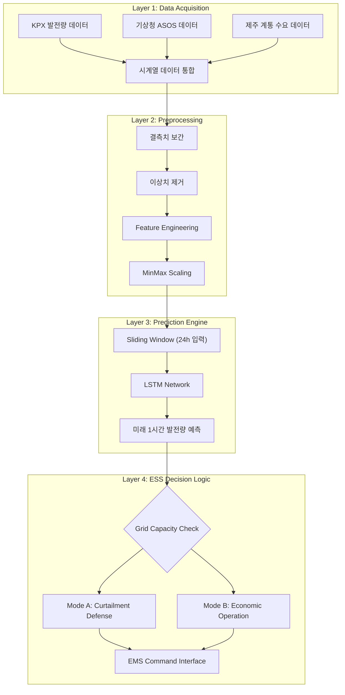
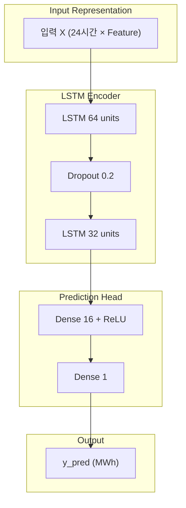
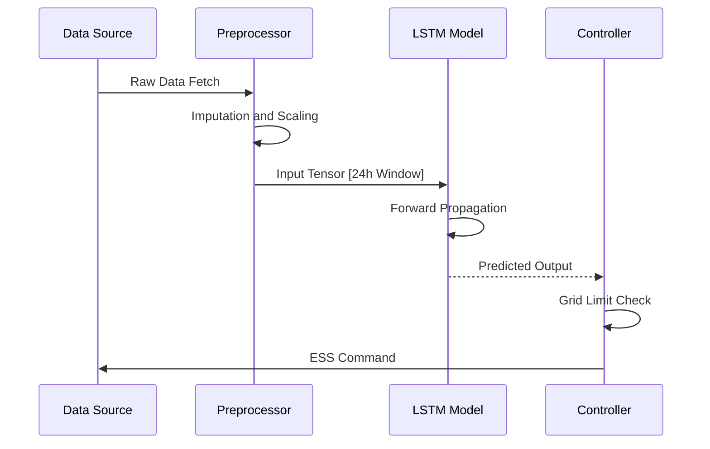
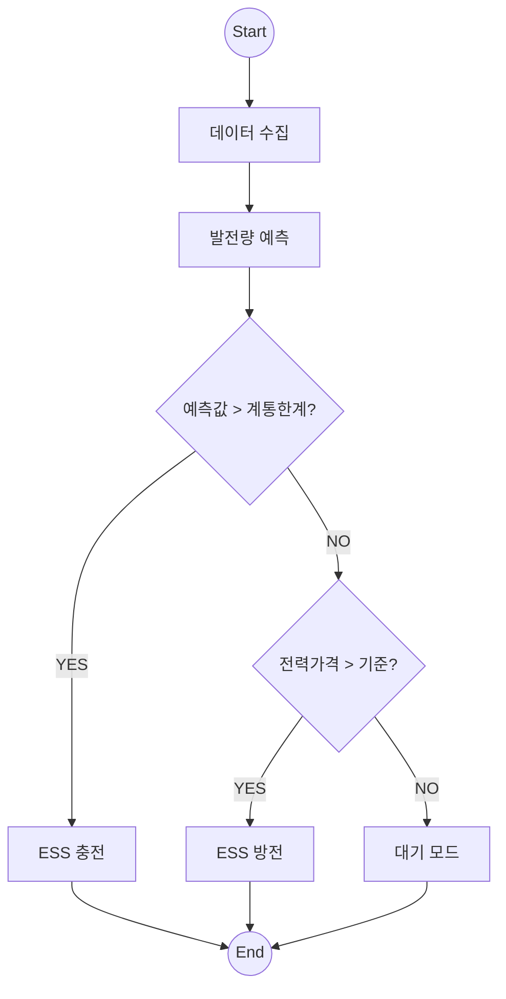

# ⚡️ 출력 제한 예측 기반 ESS-VPP 자율 대응 시스템
> Autonomous ESS-VPP Response System based on Curtailment Prediction  
> Jeju Island Renewable Energy Curtailment Solution Project

[](https://www.python.org/)
[](https://pytorch.org/)
[]()

---

## 1. 프로젝트 개요 (Executive Summary)

### 1.1 추진 배경
제주 지역 재생에너지 발전 비중 증가로 인해 계통 안정화를 위한 출력제어 발생이 급증하고 있다.  
본 프로젝트는 딥러닝 기반 예측과 ESS 자동 제어를 결합한 지능형 VPP 대응 시스템이다.

### 1.2 핵심 요약
- LSTM 기반 예측 모델 (MAE 1.98 MW)
- 출력제어 위험도 계산
- 위험도 기반 ESS 자동 충전/방전 운영

---

## 2. 시스템 아키텍처 (System Architecture)



---

## 3. 데이터 및 모델링 상세

### 3.1 데이터셋 구성
| Feature Group | Variables | Description |
|---|---|---|
| Generation | PV_Amount, WT_Amount | 태양광·풍력 발전량 |
| Weather | Irradiance, WindSpeed | 일사량·풍속 |
| Grid | System_Load | 제주 전력 수요 |
| Time | Hour_Sin, Hour_Cos | 시간 주기성 인코딩 |

### 3.2 모델 구성



### 3.3 예측 로직 시퀀스



---

## 4. 모델 성능 결과

### 4.1 정량적 지표
| Model | MAE | RMSE | R² | Notes |
|---|---:|---:|---:|---|
| ARIMA | 12.45 | 18.20 | 0.72 | Baseline |
| SVR | 8.32 | 11.05 | 0.81 | ML |
| Proposed LSTM | **1.98** | **2.85** | **0.98** | Best |

---

## 5. ESS 자율 운용 시뮬레이션

### 5.1 ESS Control Flow



---

## 6. 실행 방법

```bash
git clone https://github.com/yousoo0920/ess-vpp-project.git
cd ess-vpp-project
pip install -r requirements.txt
python main.py
```

---

## License
MIT License  
2025 ESS-VPP Project Team
