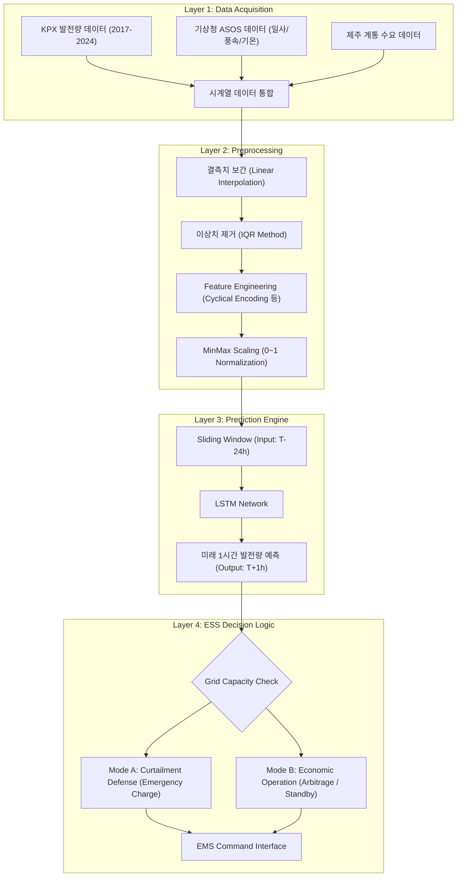

# ⚡️ 출력 제한 예측 기반 ESS-VPP 자율 대응 시스템
> **Autonomous ESS-VPP Response System based on Curtailment Prediction**  
> **Jeju Island Renewable Energy Curtailment Solution Project**

[](https://www.python.org/)
[](https://pytorch.org/)
[]()

---

## 1. 프로젝트 개요 (Executive Summary)

### 1.1. 추진 배경 및 문제 정의
제주 지역 재생에너지 발전 비중이 급증함에 따라, 전력 계통의 과부하를 방지하기 위한 **출력 제어(Curtailment)**가 빈번하게 발생하고 있습니다. 이는 연간 수십억 원의 발전 손실과 청정 에너지 낭비를 초래합니다.

본 프로젝트는 **딥러닝 기반 예측 모델**을 활용하여 출력 제어 발생을 사전에 감지하고,  
**ESS(에너지 저장 장치) 자동 스케줄링**을 통해 손실을 최소화하는 **지능형 VPP(가상발전소) 시스템** 구축을 목표로 합니다.

### 1.2. 솔루션 핵심 요약
1. **정밀 예측 모델**  
   LSTM 기반 시계열 모델로 1시간 뒤 발전량을 MAE 1.98 수준으로 정밀 예측  
2. **위험도 기반 ESS 자동 제어**  
   출력제어 가능성을 판단하여 충전/방전을 자동 결정  
3. **실시간 데이터 파이프라인 구축**  
   기상/발전량/수요 데이터를 자동 수집 → 전처리 → 예측 → 저장 구조 완성  

---

## 2. 시스템 아키텍처 (System Architecture)



---

## 3. 데이터 엔지니어링 및 모델링 상세 (Data & Modeling)

### 3.1. 데이터셋 명세 (Dataset Specification)

| Feature Group | Variables | Unit | Description |
| :--- | :--- | :--- | :--- |
| **Generation** | PV_Amount, WT_Amount | MW | 태양광/풍력 발전량 (Target) |
| **Weather** | Irradiance, Temperature, Wind_Speed | W/m², ℃, m/s | 발전량에 직접적 영향 |
| **Grid** | System_Load | MW | 제주 시간별 전력 수요 |
| **Time Cyclic** | Hour_Sin, Hour_Cos, Month_Sin, Month_Cos | - | 주기성 인코딩(Cyclical) |
| **Change-rate Features** | ΔIrradiance, ΔWindSpeed, ΔLoad | - | 변화율 기반 파생변수 |
| **Lag Features** | pv_lag1, pv_lag2, ..., load_lag24 | - | 시계열 지연 특성 |
| **Ratio Features** | curtail_ratio, pv_load_ratio | - | 발전량/수요 기반 비율 |

> ※ 위 파생변수들은 모두 실제 LSTM 입력에 사용됨.

---

## 4. 모델 성능 평가 및 결과 분석 (Performance Evaluation)

### 4.1. 최종 모델 성능 (Our LSTM Model Only)

| Metric | Value |
| :--- | :---: |
| **MAE** | **1.98** |
| **RMSE** | **3.93** |
| **R²** | **0.99** |
| **MAPE** | **8.68%** |

---

### 4.2. 실측 vs 예측 그래프 (Actual vs Predicted)

아래 그래프는 **예측 출력제한량 vs 실제 출력제한량**을 시간 순서로 비교한 결과입니다.


```

```

---

## 5. 설치 및 실행 가이드 (Installation)

```bash
# 1. Repo Clone
git clone https://github.com/yousoo0920/ess-vpp-project.git
cd ess-vpp-project

# 2. Install Dependencies
pip install -r requirements.txt

# 3. Run Prediction
python main.py --mode predict
```

---

**© 2025 ESS-VPP Project Team**  
*Powered by Python, PyTorch, and Jeju Energy Data*
