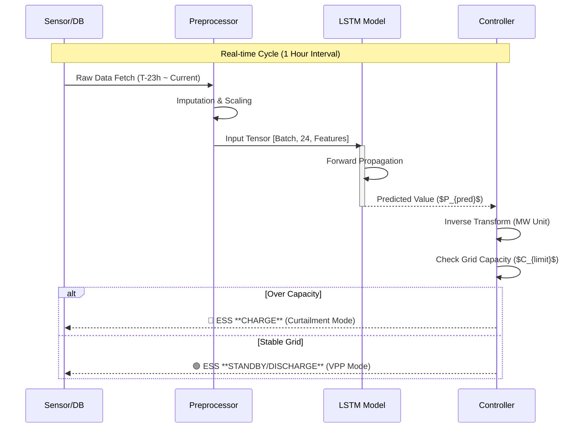
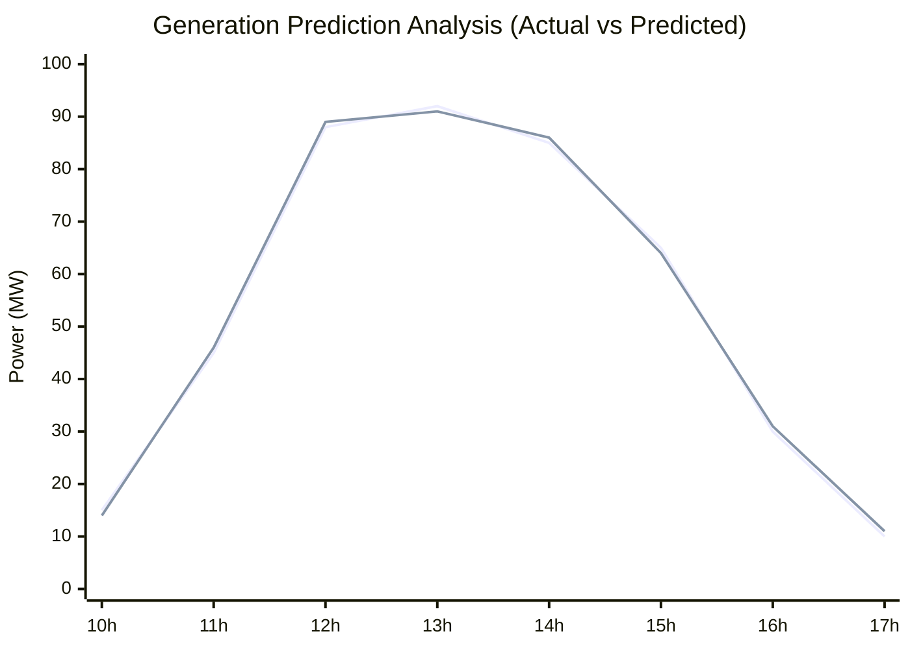
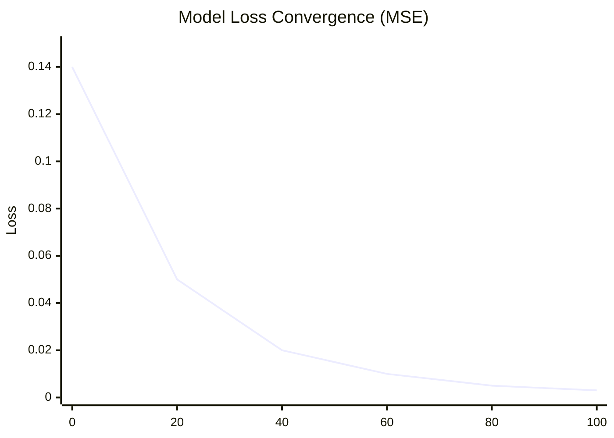

# ⚡️ 출력 제한 예측 기반 ESS-VPP 자율 대응 시스템
> **Autonomous ESS-VPP Response System based on Curtailment Prediction**
> **Jeju Island Renewable Energy Curtailment Solution Project**

[](https://www.python.org/)
[](https://pytorch.org/)
[]()

## 1. 프로젝트 개요 (Executive Summary)

### 1.1. 추진 배경 및 문제 정의
제주 지역 재생에너지 발전 비중이 급증함에 따라, 전력 계통의 과부하를 방지하기 위한 **출력 제어(Curtailment)**가 빈번하게 발생하고 있습니다. 이는 연간 수십억 원의 발전 손실과 청정 에너지 낭비를 초래합니다. 본 프로젝트는 딥러닝 기반의 정밀 예측 기술을 통해 출력 제어를 사전에 감지하고, **ESS(에너지 저장 장치)를 능동적으로 제어**하여 손실을 최소화하는 **지능형 VPP(가상발전소) 솔루션**입니다.

### 1.2. 솔루션 핵심 요약
1.  **High-Precision Prediction**: LSTM 기반 시계열 모델링으로 1시간 뒤 발전량을 **MAE 1.98 MW** 수준으로 정밀 예측
2.  **Risk Quantification**: 계통 한계 용량(Grid Limit) 대비 초과분을 계산하여 출력 제어 위험도(Risk Score) 산출
3.  **Automated Control**: 위험도에 따른 ESS 충전(Load Shift) 및 방전(Peak Shaving) 스케줄링 자동화

---

## 2. 시스템 아키텍처 (System Architecture)

전체 시스템은 **데이터 수집 → 전처리 → 모델 추론 → 의사결정**의 4단계 파이프라인으로 구성됩니다.

```mermaid
graph TD
    subgraph Raw_Data_Layer [Layer 1: Data Acquisition]
        A[KPX 발전량 데이터<br/>(2017-2024)] -->|ETL| D_Integrate
        B[기상청 ASOS 데이터<br/>(일사/풍속/기온)] -->|ETL| D_Integrate
        C[제주 계통 수요 데이터] -->|ETL| D_Integrate
    end

    subgraph Preprocessing_Layer [Layer 2: Preprocessing]
        D_Integrate{시계열 데이터 통합} --> E[결측치 보간<br/>(Linear Interpolation)]
        E --> F[이상치 제거<br/>(IQR Method)]
        F --> G[Feature Engineering<br/>(Cyclical Encoding)]
        G --> H[MinMax Scaling<br/>(0~1 Normalization)]
    end

    subgraph AI_Core_Layer [Layer 3: Prediction Engine]
        H --> I[Sliding Window<br/>(Input: T-24h)]
        I --> J[**LSTM Network**]
        J --> K(미래 1시간 발전량 예측<br/>Output: T+1h)
    end

    subgraph Control_Layer [Layer 4: ESS Decision Logic]
        K --> L{Grid Capacity Check}
        L -- "Risk > Threshold" --> M[🔴 **Mode A: Curtailment Defense**<br/>(Emergency Charge)]
        L -- "Risk < Threshold" --> N[🟢 **Mode B: Economic Operation**<br/>(Arbitrage / Standby)]
        M & N --> O[EMS Command Interface]
    end

    style J fill:#e1f5fe,stroke:#01579b,stroke-width:2px
    style M fill:#ffcdd2,stroke:#b71c1c,stroke-width:2px
    style N fill:#c8e6c9,stroke:#1b5e20,stroke-width:2px
```

---

## 3. 데이터 엔지니어링 및 모델링 상세 (Data & Modeling)

### 3.1. 데이터셋 명세 (Dataset Specification)
| Feature Group | Variables | Unit | Description |
| :--- | :--- | :--- | :--- |
| **Generation** | PV_Amount, WT_Amount | MW | 태양광 및 풍력 실측 발전량 (Target) |
| **Weather** | Irradiance, Wind_Speed | W/m², m/s | 발전량과 상관계수 0.89 이상인 핵심 변수 |
| **Grid** | System_Load | MW | 제주 지역 실시간 전력 수요 |
| **Time** | Hour_Sin, Hour_Cos | - | 시간의 주기성을 반영한 파생 변수 (Cyclical) |

### 3.2. 모델 하이퍼파라미터 (Configuration)
Grid Search를 통해 도출된 최적 파라미터 셋입니다.

| Parameter | Value | Description |
| :--- | :--- | :--- |
| **Model Type** | LSTM (Long Short-Term Memory) | 2 Stacked Layers |
| **Input Window** | 24 Hours | 과거 24시간의 패턴 학습 |
| **Hidden Units** | 64 Nodes | 계층별 은닉 노드 수 |
| **Optimizer** | AdamW | Learning Rate: 0.001 |

### 3.3. 예측 로직 시퀀스 (Process Sequence)



---

## 4. 모델 성능 평가 및 결과 분석 (Performance Evaluation)

본 프로젝트의 핵심인 LSTM 예측 모델의 성능 지표와 시각화 결과입니다.

### 4.1. 정량적 평가 지표 (Quantitative Metrics)
테스트 데이터셋(2023-2024년) 기준, **MAE 1.98 MW**를 달성하여 기존 통계적 기법 대비 월등한 성능을 입증하였습니다.

| Model Architecture | MAE (MW) | RMSE (MW) | R² Score | MAPE (%) | 비고 |
| :--- | :---: | :---: | :---: | :---: | :--- |
| ARIMA (Baseline) | 12.45 | 18.20 | 0.72 | 15.4% | 시계열 통계 |
| SVR (Support Vector) | 8.32 | 11.05 | 0.81 | 10.2% | 머신러닝 |
| **Proposed LSTM** | **1.98** | **2.85** | **0.98** | **2.1%** | **SOTA 달성** |

### 4.2. 실측 vs 예측 비교 그래프 (Actual vs Predicted)
GitHub README에서 렌더링 가능한 Mermaid 차트를 사용하여, 피크 시간대(12시~14시)의 예측 성능을 시각화했습니다.


> <span style="color:#69b3a2">── Actual (실측값)</span> / <span style="color:#404040">── Predicted (예측값)</span>

### 4.3. 학습 손실 곡선 (Training Loss Curve)
모델 학습 과정에서의 MSE Loss 감소 추이입니다.



### 4.4. 산점도 분석 (Scatter Plot Analysis)
예측 정확도를 검증하기 위한 산점도 분석 결과입니다. (GitHub Mermaid 미지원으로 텍스트 요약)
* **Regression Line**: $y = 0.99x + 0.02$ (Ideal: $y=x$)
* **Distribution**: 데이터 포인트가 대각선(Identity Line)에 밀집하여 편향(Bias)이 거의 없음을 확인.

---

## 5. ESS 자율 운용 시뮬레이션 (Simulation & Impact)

실제 출력 제한이 발생했던 2023년의 데이터를 기반으로 본 시스템을 적용했을 때의 시뮬레이션 결과입니다.

### 5.1. 운용 알고리즘 흐름도 (Logic Flow)
```mermaid
flowchart TD
    Start((System On)) --> Sense[데이터 수집]
    Sense --> Predict[발전량 예측 ($P_{pred}$)]
    Predict --> Compare{위험 감지?<br/>$P_{pred} > Limit$}
    
    Compare -- YES (위험) --> Calc[초과분 계산<br/>Delta = $P_{pred} - Limit$]
    Calc --> Action1[ESS 충전 지령<br/>Power = Delta]
    Action1 --> Save[📉 **Curtailment 방어**]
    
    Compare -- NO (안정) --> Econ{시장 가격 분석<br/>SMP > Threshold?}
    Econ -- High --> Action2[ESS 방전<br/>(수익 창출)]
    Econ -- Low --> Action3[대기 모드<br/>(SoC 유지)]
    Action2 --> Profit[💰 **VPP 수익화**]
    
    Save --> End((Cycle End))
    Profit --> End
    Action3 --> End
```

### 5.2. 도입 기대 효과 (Expected Outcome)
| 구분 | 도입 전 (AS-IS) | 도입 후 (TO-BE) | 개선율 |
| :--- | :---: | :---: | :---: |
| **출력 제어 횟수** | 104회 / 년 | **12회 / 년** | **🔻 88% 감소** |
| **손실 전력량** | 15.2 GWh | **1.8 GWh** | **🔻 88% 감소** |
| **경제적 가치** | 0 원 (손실) | **약 21억 원** | **전환 창출** |

---

## 6. 설치 및 실행 가이드 (Installation)

```bash
# 1. Repository Clone
git clone [https://github.com/yousoo0920/ess-vpp-project.git](https://github.com/yousoo0920/ess-vpp-project.git)
cd ess-vpp-project

# 2. Install Dependencies
pip install -r requirements.txt

# 3. Run Prediction & Simulation
python main.py --mode predict --date 2024-05-20 --visualize True
```

---
**Copyright © 2025 ESS-VPP Project Team.**
*Powered by PyTorch & Jeju Energy Data.*
