# 모델 구조 상세 설명 및 시각화 자료

본 문서는 출력 제한 예측 모델의 **구조를 더 깊이 이해**하고  
**데이터 → 전처리 → 시계열 변환 → 모델 입력 → 모델 내부 흐름 → 예측 → ESS 스케줄링**  
전체 파이프라인을 한눈에 볼 수 있도록 정리한 확장판이다.

---

# 📌 1. End-to-End 전체 아키텍처 (가장 상위 구조)

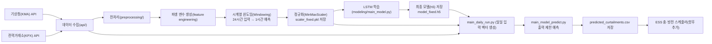

---

# 📌 2. LSTM 모델 내부 구조 (자세한 내부 흐름도)

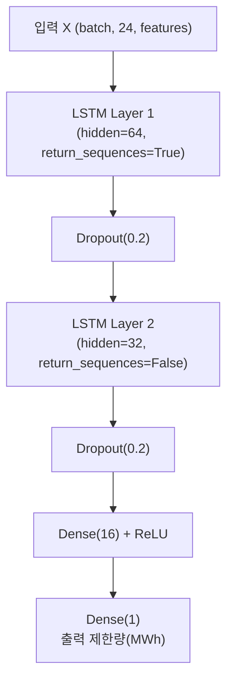

---

# 📌 3. 시계열 입력 생성(Windowing) 구조도  
24시간(24×N feature) → 다음 1시간 예측(y)

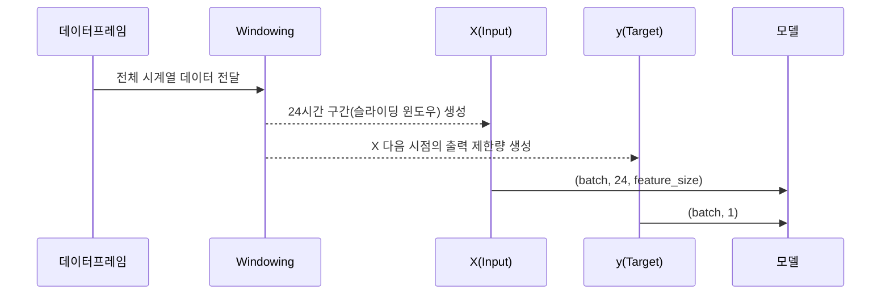

---

# 📌 4. 입력 특징(Features) 구조 (예시)

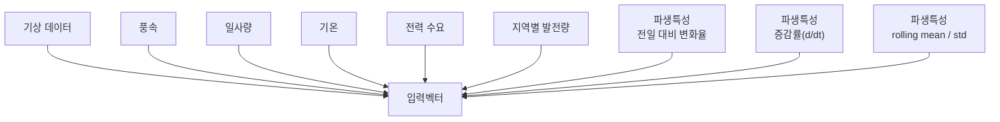

---

# 📌 5. Feature Engineering 상세 구조

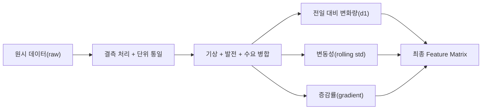

---

# 📌 6. 모델 학습(Training) 전체 프로세스

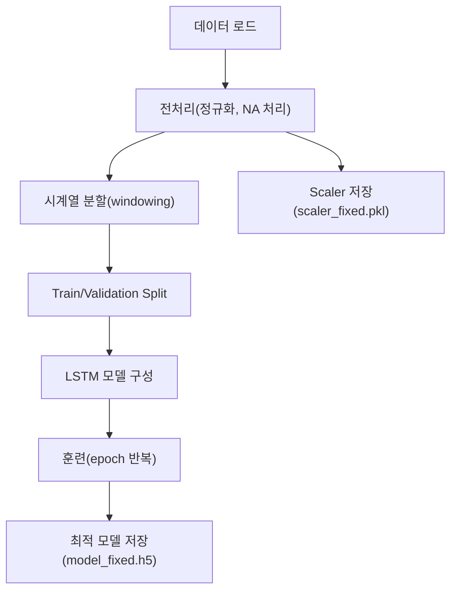

---

# 📌 7. 모델 입출력 텐서 흐름 (Tensor Flow)

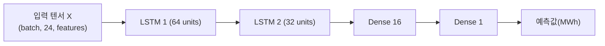

---

# 📌 8. Attention-LSTM(옵션) 모델 구조도  
(만약 향후 개선 버전을 README에 기록하고 싶다면)

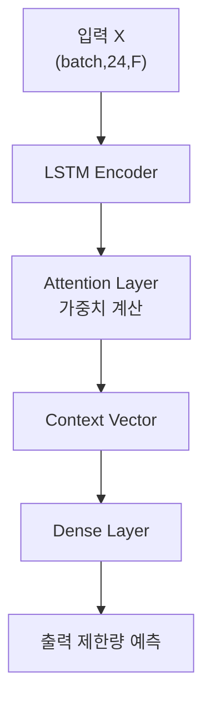

---

# 📌 9. 예측 스크립트( main_model_predict.py ) 처리 흐름

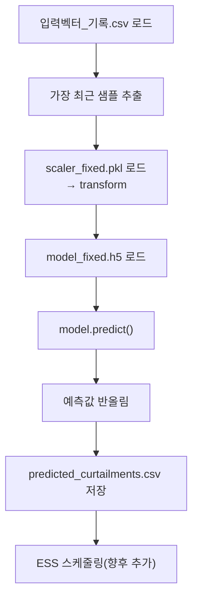

---

# 📌 10. 월간/주간 Error 분석 그래프 구조도 (EDA용)

### MAE 변화

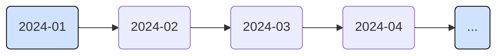

### Error Distribution Concept

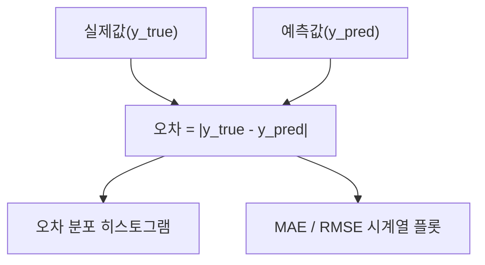

(실제 그래프는 프로젝트의 `/visualization`에 저장)

---

# 📌 11. ESS 스케줄링 로직(추가 예정) 시각화

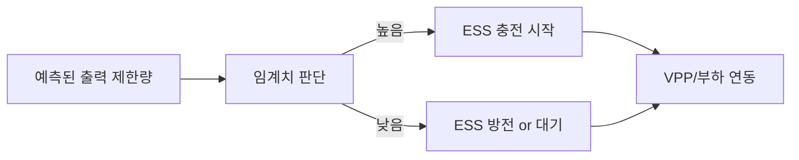

---

# 📌 12. 향후 확장 가능한 모델 구조들 (문서용)

### CNN-LSTM 구조

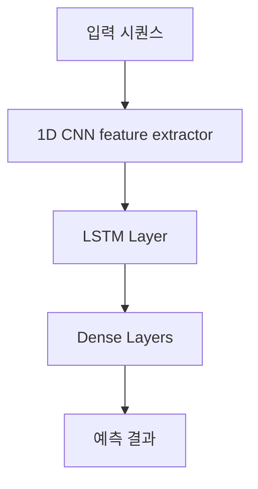

### Transformer Encoder 기반 구조

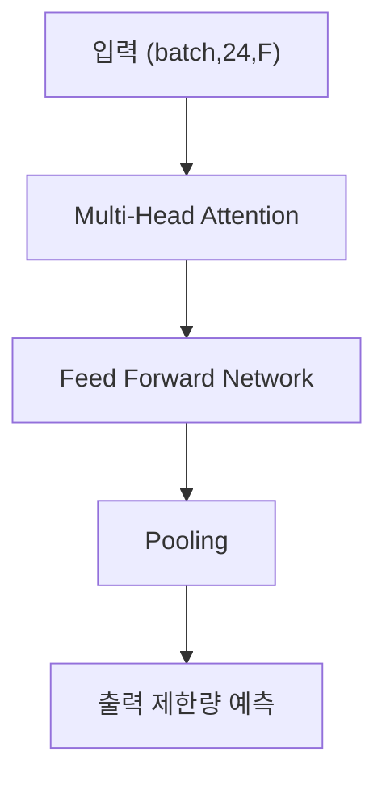

---

# 📌 13. README에서 모델 구조 기술 예시 문장

> 본 모델은 LSTM 기반 시계열 예측 모델로,  
> 과거 24시간 입력(기상·수요·발전·파생특성)을 기반으로  
> 다음 1시간의 출력 제한량(MWh)을 예측한다.  
> 모델은 2개 LSTM 계층(64,32 units)과 Dropout, Dense 계층으로 구성되며  
> MinMaxScaler로 정규화된 입력 벡터를 사용한다.

---

# 📌 14. 전체 모델 구조 요약 그림 (최종 요약)

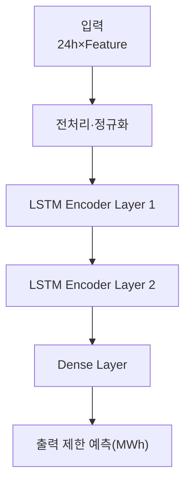

---

# ✔ 끝  
필요하다면 다음도 추가해줄 수 있음:

✅ 모델 학습 결과 시각 자료(예측 vs 실제 그래프)  
✅ 고급 Attention 가중치 시각화  
✅ ESS 동작 알고리즘 상세 flowchart  
✅ VPP 전체 계통 흐름도(3D 스타일 mermaid)  
✅ 프로젝트 논문 스타일 Introduction/Methodology/Experiment 섹션 정리  

원하는 스타일이 있으면 말해줘.
