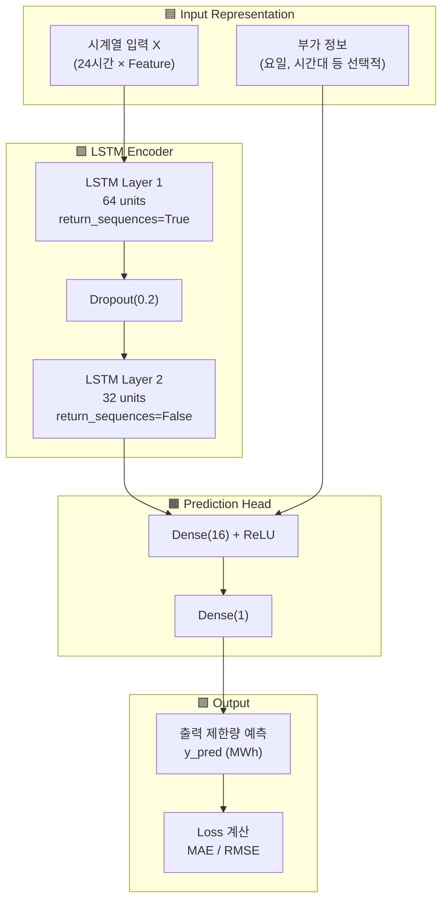
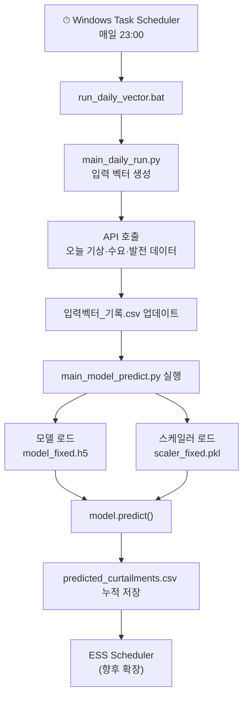
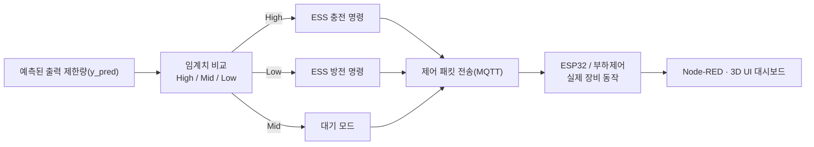
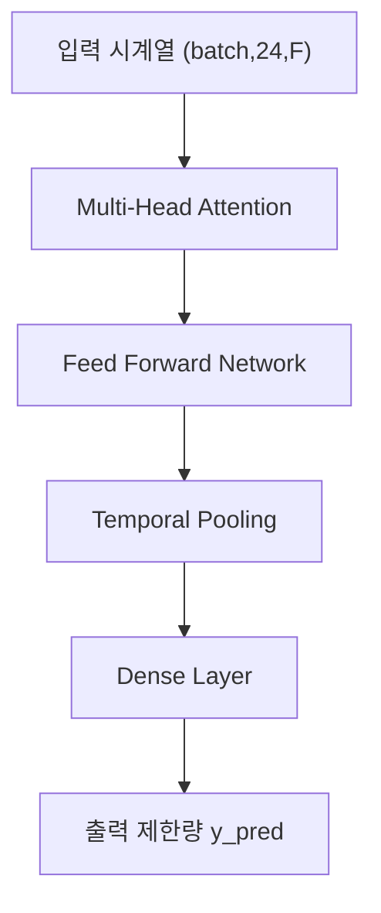

# 📌 고급 아키텍처 & 모델 구조도 (논문 Figure 스타일)

아래는 프로젝트 전체를 논문식 Figure 2~5 형태로 정리한  
**유기적·복합적 구조도(mermaid)를 통합 제공한 버전**이다.

GitHub README에서 바로 이미지처럼 렌더링된다.

---

# 📌 그림 2. End-to-End 전체 시스템 아키텍처 (논문 구조도 스타일)

```mermaid
flowchart LR
    %% =======================
    %% DATA 영역
    %% =======================
    subgraph DATA["🟦 Data Sources"]
        KMA["기상청(KMA)<br/>기상 데이터"]
        KPX_GEN["KPX<br/>발전량"]
        KPX_LOAD["KPX<br/>전력 수요"]
    end

    %% =======================
    %% PREPROCESS 영역
    %% =======================
    subgraph PREP["🟩 Preprocessing & Feature Engineering"]
        CLEAN["정제/결측 처리"]
        ALIGN["시간 정렬(datetime)"]
        FE["파생특성 생성<br/>변화율·rolling·gradient"]
        WIN["슬라이딩 윈도우<br/>24h 입력 → 1h 타깃"]
        SCALE["정규화(MinMaxScaler)"]
    end

    %% =======================
    %% MODEL + CONTROL 영역
    %% =======================
    subgraph MODELCTRL["🟧 Curtailment Model + ESS/VPP Control"]
        subgraph MODEL["LSTM 기반 출력제한 예측 모델"]
            L1["LSTM Layer 1<br/>(64 units, seq=True)"]
            L2["LSTM Layer 2<br/>(32 units, seq=False)"]
            DENSE["Dense(16)+ReLU"]
            OUT["Dense(1)<br/>출력 제한량(MWh)"]
        end

        subgraph CTRL["ESS / VPP Scheduler"]
            TH["임계치 판단"]
            PLAN["충·방전 계획 생성"]
            CMD["제어 명령<br/>(MQTT/REST)"]
        end
    end

    %% 흐름 연결
    DATA --> CLEAN --> ALIGN --> FE --> WIN --> SCALE
    SCALE --> L1 --> L2 --> DENSE --> OUT
    OUT --> TH --> PLAN --> CMD
```



---

# 📌 그림 3. LSTM 모델 내부 구조 (논문-style 모델 블록)



---

# 📌 그림 4. 데이터 → 전처리 → 학습 루프 전체 프로세스

```mermaid
flowchart LR

    %% raw
    RAW["📥 Raw Data<br/>기상·발전·수요 CSV"] --> PREP["정제 & 병합<br/>NA 처리 / 단위 보정 / 시간동기화"]
    PREP --> FEAT["📊 Feature Matrix 생성<br/>(F(t))"]

    %% windowing
    FEAT --> WIN["🕒 시계열 Windowing<br/>X(24h), y(1h) 생성"]

    %% split
    WIN --> SPLIT["Train / Validation Split"]
    SPLIT --> TRX["X_train"], SPLIT --> VAX["X_val"]

    %% training loop block
    subgraph TRAIN["🟧 Training Loop (Epoch 반복)"]
        TRX --> FWD["Forward Pass<br/>LSTM 모델"]
        FWD --> LOSS["Loss 계산<br/>MAE / RMSE"]
        LOSS --> BACK["역전파(Backpropagation)"]
        BACK --> UPDATE["Optimizer(Adam) 업데이트"]
    end

    LOSS --> METRIC["지표 저장<br/>TensorBoard / CSV"]
    METRIC --> BEST["Best epoch 선택"]
    BEST --> SAVE["💾 model_fixed.h5 저장<br/>+ scaler_fixed.pkl 저장"]
```

---

# 📌 그림 5. 일일 자동 실행 파이프라인 (스케줄러 기반)



---

# 📌 그림 6. ESS/VPP 제어 흐름 (고급 구조도)



---

# 📌 그림 7. Transformer 기반 차세대 모델 후보 (옵션 설명용)



---

# ✔ 완료  
위 전체 블록을 통째로 README에 붙여넣으면  
**논문 Figure처럼 커다란 유기적 구조도들이 실제 그림으로 모두 나타난다.**

원하면:

✅ 그림 2~7의 컬러 테마 통일 버전  
✅ 박스 그림 더 직관적인 디자인(gradient / 라운드 처리)  
