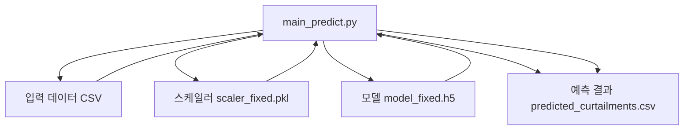
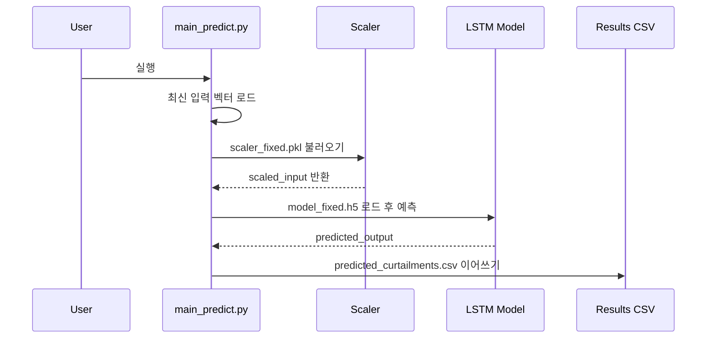
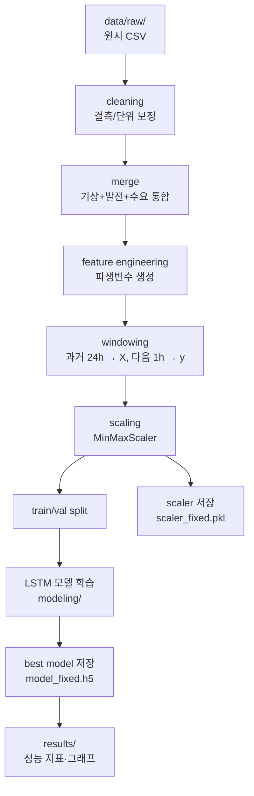
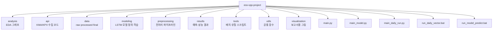

# 출력 제한 예측 기반 ESS 및 VPP 자율 대응 시스템

## 1. 프로젝트 개요
본 프로젝트는 제주지역 재생에너지 발전소의 출력 제한(curtailment) 문제를 해결하기 위해,  
기상·발전량·전력수요 데이터를 기반으로 출력 제한을 예측하고 이에 대응하는 ESS 충·방전 스케줄링 시스템을 구현하는 것을 목표로 한다.

## 2. 데이터 구성
- 발전량 데이터 (2017~2024, 한국전력거래소)
- 기상 데이터 (2022~2024, 기상청 4지점 평균, 풍향 제외)
- 전력수요 데이터 (제주지역 시간별 수요, 단위 보정 및 시간 보정 처리)

모든 데이터를 시간 단위(datetime 기준)로 통일하고 결측은 0으로 보완하였다.

## 3. 시스템 구조

```
기상/수요/발전량 정제 → 시계열 통합 → 상관분석 → 시계열 입력 생성 → LSTM 학습/예측 → ESS 운용 판단
```

## 4. 모델 설계
- 입력 시퀀스: 과거 24시간
- 출력: 다음 1시간 태양광 or 풍력 발전량
- 모델: LSTM (PyTorch 기반)
- 정규화: MinMaxScaler

## 5. 결과 요약
- 예측 정확도(MAE 기준): TBD
- 일사량과 태양광 발전량의 상관관계: 0.89
- 풍속과 풍력 발전량의 상관관계: 0.69
- 풍향 제거 결정: 벡터 평균의 불안정성으로 제외함

## 6. 폴더 구조

```
Curtailment_Predictor_Project/
├─ data/
│   ├─ raw/
│   ├─ processed/
│   └─ final/final_input_X.csv
├─ scripts/
│   ├─ preprocessing/
│   ├─ analysis/
│   ├─ modeling/
├─ results/
├─ reports/
└─ README.md
```
```mermaid
flowchart TD
    A[입력벡터 CSV 로드<br/>입력벡터_기록.csv] --> B[가장 최근 벡터 추출]
    B --> C[스케일러 로드<br/>scaler_fixed.pkl]
    C --> D[입력 벡터 스케일링]

    D --> E[모델 로드<br/>model_fixed.h5]
    E --> F[model.predict() 수행]

    F --> G[출력 제한량 계산<br/>round(prediction, 2)]
    G --> H[예측 결과 콘솔 출력]

    H --> I[결과 CSV 파일 생성/이어쓰기<br/>predicted_curtailments.csv]
```


```mermaid
flowchart LR
    KMA[기상청 API<br/>기상 데이터] --> API[api/ 스크립트<br/>데이터 수집]
    KPX[전력거래소 API<br/>발전·수요 데이터] --> API

    API --> PP[preprocessing/<br/>전처리 & 피처엔지니어링]
    PP --> DS[data/processed<br/>학습 입력·타깃]

    DS --> TRAIN[modeling/<br/>LSTM 학습(main_model.py)]
    TRAIN --> MODEL[저장된 모델<br/>model_fixed.h5]
    TRAIN --> SCALER[저장된 스케일러<br/>scaler_fixed.pkl]

    MODEL --> PRED[main_daily_run.py<br/>일일 예측]
    SCALER --> PRED
    API --> PRED

    PRED --> RES[results/<br/>predicted_curtailments.csv]
    RES --> SCHED[ESS·VPP 스케줄러<br/>(추가 구현)]
    SCHED --> HW[라즈베리파이·ESP32·부하<br/>실험 데모]
```

```mermaid
flowchart TD
    TS[Windows Task Scheduler<br/>23:00] --> BAT1[run_daily_vector.bat]
    BAT1 --> PY1[main_daily_run.py]

    PY1 --> A1[api/<br/>오늘 데이터 추가 수집]
    A1 --> P1[preprocessing/<br/>입력벡터 업데이트<br/>입력벡터_기록.csv]

    P1 --> PY2[main_model_predict.py<br/>(예측 스크립트)]
    PY2 --> LOADM[모델 & 스케일러 로드<br/>model_fixed.h5, scaler_fixed.pkl]
    LOADM --> PRED[model.predict()]

    PRED --> CSV1[results/<br/>predicted_curtailments.csv<br/>누적 저장]
    CSV1 --> ESS[ESS 스케줄링 로직<br/>(향후 적용)]
```

```mermaid
flowchart LR
    CSV[입력벡터_기록.csv<br/>마지막 행 로드] --> SCALE[scaler_fixed.pkl<br/>transform]
    SCALE --> MODEL[model_fixed.h5<br/>load_model]
    MODEL --> PRED[model.predict()<br/>출력제한량 예측]
    PRED --> OUT_CSV[predicted_curtailments.csv<br/>날짜·예측값 이어쓰기]
    PRED --> PRINT[콘솔 출력<br/>예측된 출력제한량]
```
