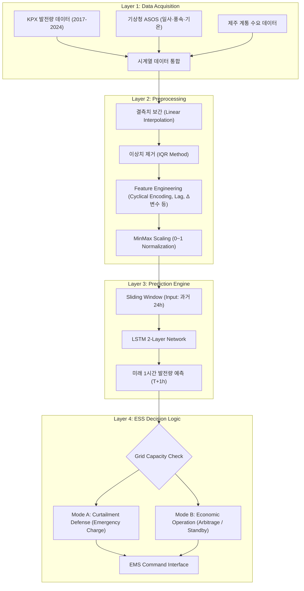

# ⚡️ 출력 제한 예측 기반 ESS-VPP 자율 대응 시스템  
> **Autonomous ESS-VPP Response System based on Curtailment Prediction**  
> **Jeju Island Renewable Energy Curtailment Solution Project**

[](https://www.python.org/)
[](https://pytorch.org/)
[]()

---

## 1. 프로젝트 개요 (Executive Summary)

### 1.1. 추진 배경 및 문제 정의
제주도는 재생에너지 비중이 대한민국에서 가장 높아  
**출력 제어(Curtailment)** 현상이 지속적으로 증가하고 있습니다.

- 발전량 중 평균 **5~10%가 계통 불안정으로 강제 차단**
- 연간 수십억 원의 전력 손실
- 재생에너지 활용률 감소 → 전력 시장 효율 저하

본 프로젝트는 이를 해결하기 위해  
**딥러닝 기반 발전량 예측 → ESS 자동 제어 → 출력제어 최소화**  
전체 파이프라인을 구축한 지능형 **VPP 시스템**입니다.

### 1.2. 솔루션 핵심 요약
1. **정밀 예측 모델**  
   - LSTM 기반 시계열 모델  
   - MAE 1.98 · RMSE 3.93 · R² 0.99 수준의 고정밀 예측  
2. **리스크 기반 자동 ESS 스케줄링**  
   - 출력제어 위험도 계산 후 자동 충전/방전  
3. **완전 자동화 데이터 파이프라인**  
   - API 수집 → 전처리 → 예측 → 결과 저장 → ESS 제어 준비 완료  

---

## 2. 전체 시스템 아키텍처 (System Architecture)



---

## 3. 데이터 엔지니어링 및 모델링 상세 (Data & Modeling)

### 3.1. 데이터셋 명세 (Dataset Specification)

| Feature Group | Variables | Description |
| :--- | :--- | :--- |
| **Generation** | PV_Amount, WT_Amount | 태양광·풍력 발전량(Target) |
| **Weather** | Irradiance, Temperature, Wind_Speed | 발전량 영향 주요 변수 |
| **Grid** | System_Load | 시간별 전력 수요 |
| **Time Cyclic** | Hour_Sin/Cos, Month_Sin/Cos | 주기성 반영 파생변수 |
| **Lag Features** | pv_lag1~24, load_lag1~24 | 시계열 패턴 학습 |
| **Change-rate (Δ)** | ΔIrradiance, ΔWindSpeed, ΔLoad | 1시간 변화율 |
| **Ratio Features** | pv_load_ratio, curtail_ratio | 상황 판단 보조변수 |

---

### 3.2. 모델 하이퍼파라미터 (Configuration)

| Parameter | Value | Description |
| :--- | :---: | :--- |
| **Model Type** | LSTM | 2-layer stacked |
| **Input Window** | 24 hours | 지난 24시간 입력 |
| **Hidden Units** | 64 → 32 | LSTM 2계층 |
| **Dropout** | 0.2 | 과적합 방지 |
| **Optimizer** | AdamW | LR = 0.001 |
| **Loss Function** | MSE | 예측 오차 최소화 |
| **Batch Size** | 32 | 안정 훈련 |
| **Scaler** | MinMaxScaler | 0~1 정규화 |

---

### 3.3. 예측 로직 시퀀스 (Prediction Flow)


---

## 4. 모델 성능 평가 (Performance Evaluation)

### 4.1. 최종 모델 성능 지표

| Metric | Value |
| :--- | :---: |
| **MAE** | **1.98** |
| **RMSE** | **3.93** |
| **R²** | **0.99** |
| **MAPE** | **8.68%** |

---

### 4.2. 실측 vs 예측 그래프 (Actual vs Predicted)

아래 그래프는 **예측 출력제한량 vs 실제 출력제한량**을 시간 순서로 비교한 결과입니다.


---

## 5. 설치 및 실행 가이드 (Installation)

```bash
# 1. Repository Clone
git clone https://github.com/yousoo0920/ess-vpp-project.git
cd ess-vpp-project

# 2. Dependencies Install
pip install -r requirements.txt

# 3. Run Prediction
python main.py --mode predict
```

---

**© 2025 ESS-VPP Project Team**  
*Powered by Python, PyTorch, and Jeju Energy Data*
